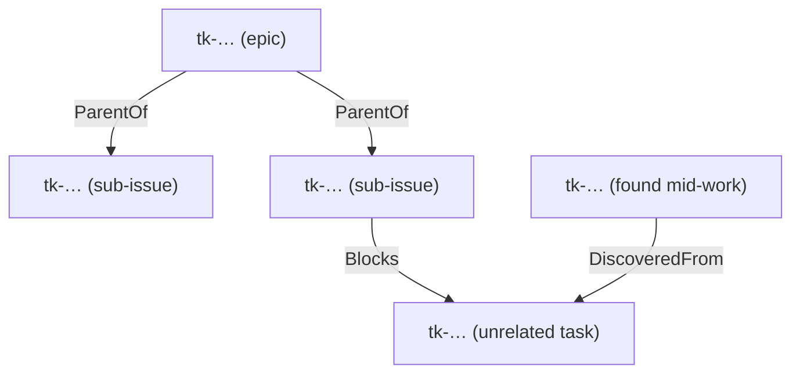
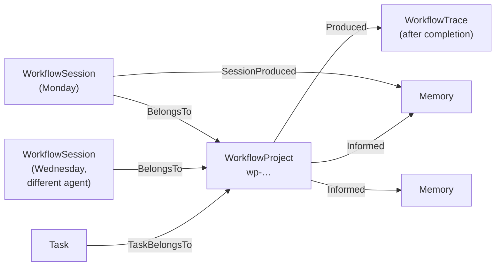
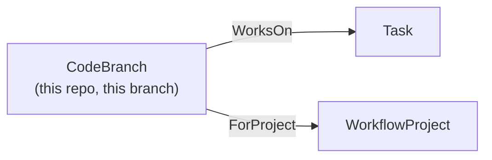

# The task and project graph

Two questions live at this layer, and they're answered by different node
types: **what needs doing** (`Task`), and **what we're trying to achieve**
(`WorkflowProject`). You'll touch tasks constantly and projects occasionally —
most work is a task with no project at all.

## Tasks: dependency-aware, hierarchical

A `Task` has a `status` (`open` → `in_progress` → `closed`, with `blocked`
alongside `open` for anything waiting on a dependency) and can relate to other
tasks three ways:

- **`ParentOf`** — hierarchy. An epic decomposes into sub-issues; closing the
  epic doesn't require closing its children, but listing an epic's children is
  a one-hop query.
- **`Blocks`** — dependency. `task_ready` computes "ready" from this: a task is
  ready once everything that `Blocks` it has closed. Closing a blocker
  automatically makes its dependents eligible — nobody maintains the ready
  list by hand.
- **`DiscoveredFrom`** — provenance. Follow-up work found mid-task links back
  to the task that surfaced it, which is the detail people skip and later wish
  they'd kept.

See [Coordinating work](../explanation/task-coordination.md) for what a claim
on a task actually guarantees (less than a lock, more than nothing), and the
[graph schema reference](../reference/graph-schema.md#task) for every field.

## Projects: an objective across sessions

A `WorkflowProject` tracks something bigger than one sitting — it moves
through four phases (`discovery` → `spec` → `implementation` → `delivery`) and
accumulates one `WorkflowSession` per agent session that contributes to it:

The mechanism that makes this useful is the **session boundary**. Each session
calls `workflow_session_start` on arrival and `workflow_session_end` with a
summary before it stops. That summary is what a *different* session — a
different agent, days later — reads to pick the thread back up. There is no
hand-off document to go stale, because the hand-off is a graph edge.

When the project finishes, `workflow_project_complete` rolls every session up
into one immutable `WorkflowTrace` — session count, phases traversed, total
duration, and an outcome narrative — kept for later pattern mining, not for
day-to-day reading.

## Where a git branch fits in

Claiming a task or starting a session both quietly write a `CodeBranch` node,
linking your current repo+branch to whatever's in flight:

No command, no configuration — it rides along on `task_claim` and
`workflow_session_start`, and it's why "which branch carries task X" is a
one-hop query instead of something someone has to remember to note down.

## A worked thread

One concrete path through all of it, the way it actually accretes during real
work:

1. You claim `tk-retry-drops-last-error-4f9c21` → `task_claim` writes a
   `CodeBranch` linking your branch to that task.
2. While fixing it you notice the retry loop also swallows a *different*
   error class → `task_create(title="…", description="…",
   discovered_from=["tk-retry-drops-last-error-4f9c21"])` (both `title` and
   `description` are required — `discovered_from` alone isn't a valid call)
   files `tk-swallowed-cancel-errors-b81a02`, linked `DiscoveredFrom` back to
   the task you were on.
3. You store what you learned →
   `memory_store(kind="lesson", title="…", …)` returns `les-…`, then
   `task_link(from_slug="tk-retry-drops-last-error-4f9c21", to_slug="les-…", kind="addresses")`
   ties the fix to the lesson it produced.
4. If this is one session in a longer piece of work, `workflow_session_start`
   already wrote `BelongsTo` to the project, and `memory_store`'s
   `session_slug` argument wrote `SessionProduced` from this session to that
   lesson — so `workflow_project_memories` can later answer "what did this
   project teach us?" without anyone curating a list.

Every edge above is one MCP call, made once, at the moment the fact became
true. Nothing here is a separate bookkeeping step you have to remember to go
back and do.

---

**Next:** [Three ways in: CLI, agent, skills →](interfaces.md)
