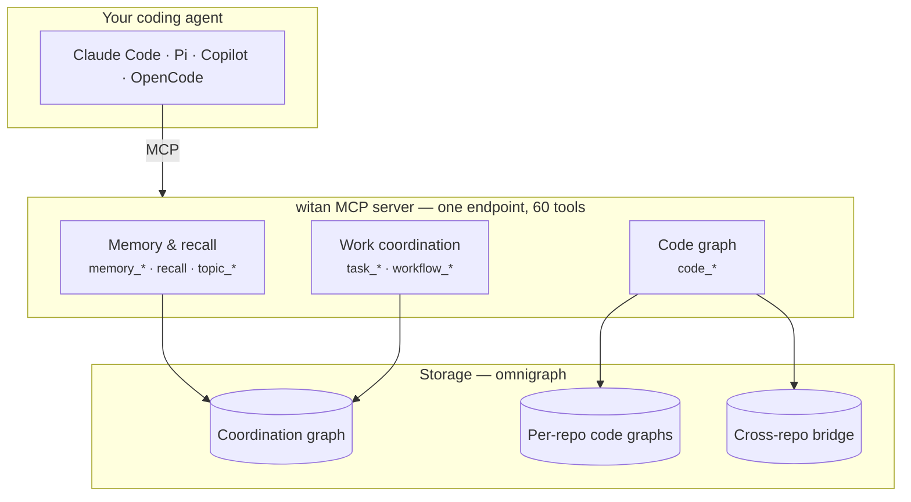

# Architecture

## Three layers, one endpoint

witan presents three conceptually separate things through a single MCP server:



`witan serve` mounts witan-code's tools into its own FastMCP server **with no
prefix**, so `code_find_definition` sits beside `memory_store` as far as the
agent is concerned. One entry in your agent's config; the whole surface.

The mount is optional and detected at import: the umbrella works standalone if
`witan-code` is not installed. That is why the packages ship separately — you
can take the coordination graph without the tree-sitter dependency tree.

## The CLI is not a second implementation

`witan tasks` does not reimplement task listing. It calls the very same
`witan.server` tool function the MCP server exposes, and formats the result.

This matters more than it sounds. Repo scoping, ready-work computation,
claim semantics, scanning — all of it lives in one place, so the CLI and your
agent cannot disagree about what the graph says. The CLI is a presentation
layer, deliberately thin.

## Two deployment shapes

=== "Local (default)"

    ```mermaid
    flowchart LR
        CLI["witan CLI"] --> S["witan tools<br/>(in-process)"]
        AGT["Agent"] -->|"MCP stdio"| S
        S --> F[("~/.local/share/witan/graph.omni")]
    ```

    Everything in one process, against a file on disk. Writes are serialised by
    a per-store advisory `flock`, which makes claims effectively safe. No
    server, no credentials, no network.

=== "Shared (deployed)"

    ```mermaid
    flowchart LR
        CLI["witan CLI"] -->|"OIDC + MCP"| W
        AGT["Agent"] -->|"MCP streamable-http"| W
        W["witan tier<br/><small>ToolHive-hosted</small>"] -->|"http"| O
        O["omnigraph-server<br/><small>data tier</small>"] --> S3[("S3")]
        CI["CI indexer<br/><small>CronJob</small>"] --> O
    ```

    Two images: the MCP tier running `witan serve --transport streamable-http`,
    and the data tier serving the S3-backed graph. The `flock` is gone — it is a
    local-filesystem lock and cannot coordinate across pods — which is the root
    of the claim-atomicity limits described in [Coordinating
    work](task-coordination.md).

The same tools work against both. Only
[`WITAN_MEMORY_URI`](../reference/environment.md) changes, plus credentials.

## Why omnigraph

The store is [omnigraph](https://github.com/ModernRelay/omnigraph): a
property-graph engine over Lance, addressable as a local file, an `s3://` root,
or an HTTP server. Three properties made it the right substrate:

- **One store type covers all three deployment shapes.** A local file and a
  shared cluster graph are the same engine, so nothing about the data model has
  to change when a team outgrows a laptop.
- **Typed nodes and edges with BM25 indexes.** Memory search and graph
  traversal are both first-class, which is precisely the combination `recall`
  needs.
- **Branchable views.** The code graph leans on this: each git branch gets its
  own view, so an index built on a feature branch is invisible to everyone else
  until it is not.

The costs are real and worth naming. omnigraph offers **no conditional-write
primitive**, which is why task claims are best-effort. Stores are also **not
relocatable** — a Lance store embeds absolute paths, so moving one means
export → init → load, never `mv`. And the client shells out to a pinned
`omnigraph` binary, which must be on `PATH` for the server to even start.

## What happens on a tool call

Taking `memory_store` as the example, because it exercises the whole path:

1. **Repo detection.** The current repo is resolved from `.git/config`, or from
   [`WITAN_REPO`](../reference/environment.md) if set — which also skips git
   entirely, and is why hooks set it.
2. **Identity.** The author is resolved from config, environment, or git. On a
   deployed server the actor comes from the validated OIDC token instead.
3. **Content scanning.** The write is scanned for secrets and PII *before* it
   persists. Secrets block by default; PII is redacted and the call proceeds.
   A scanner that itself raises also blocks — [fail
   closed](decisions/0001-write-path-content-scanning.md).
4. **The write.** Batched into as few graph commits as possible; a tool call
   that touches several tables is one commit, not four.
5. **The notice.** Anything the scanner rewrote is reported back in the tool's
   result, so a redaction is never silent.

Step 3 is the one people are surprised by. It is on the write path rather than
bolted on afterwards because the failure it prevents — a secret pasted into a
memory and then synced to a shared team store — is not recoverable once it has
happened.

## Where things live

| Concern | Package |
| --- | --- |
| Memory, tasks, workflow, the `witan` CLI | `witan-council` |
| Tree-sitter indexing, cross-repo bridge, `code_*` | `witan-code` |
| Graph client, OIDC + remote proxy, observability, repo keys | `witan-core` |
| Installing all of it | `ol-agent-kit` |

`witan-core`'s base modules are stdlib-only on purpose, with heavier concerns
behind extras (`cli`, `mcp`, `remote`), so neither server drags in weight it does
not use.
