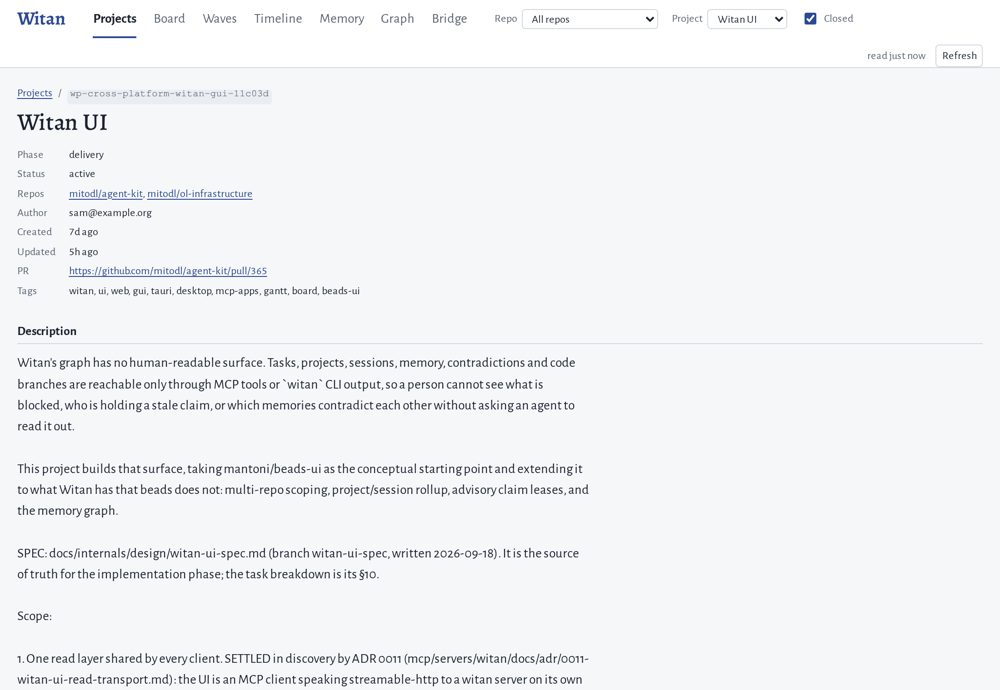
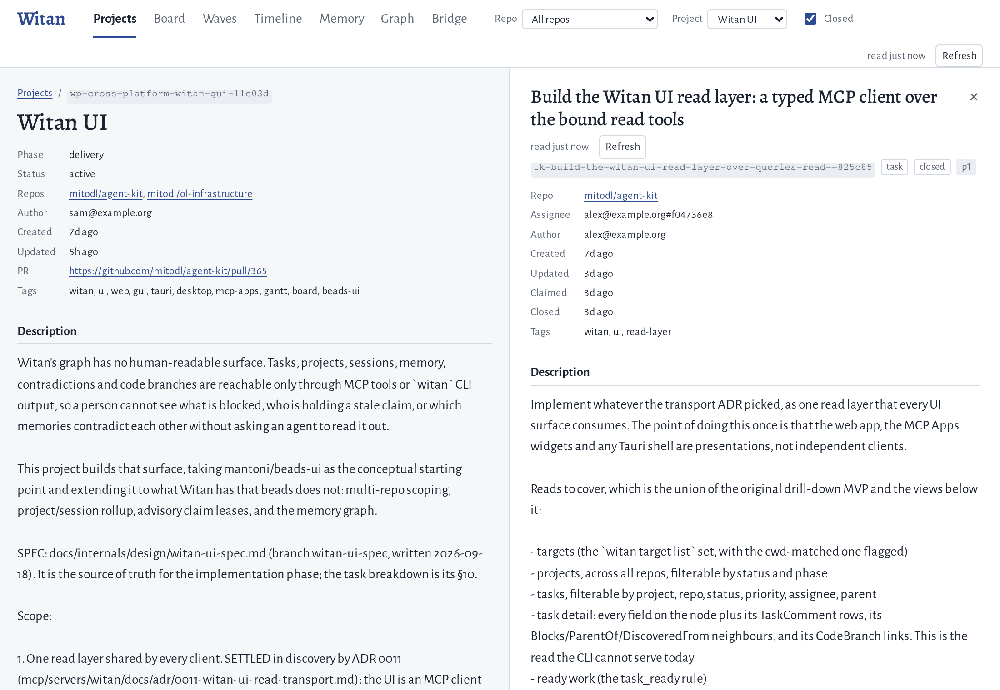
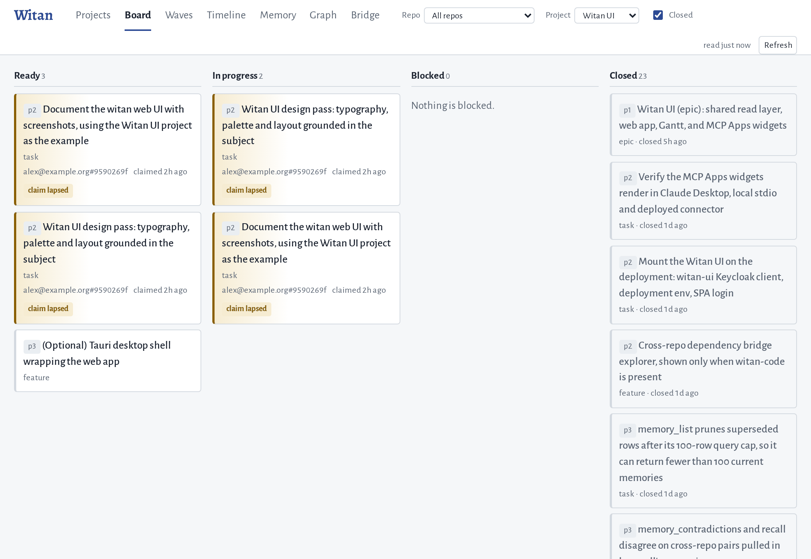
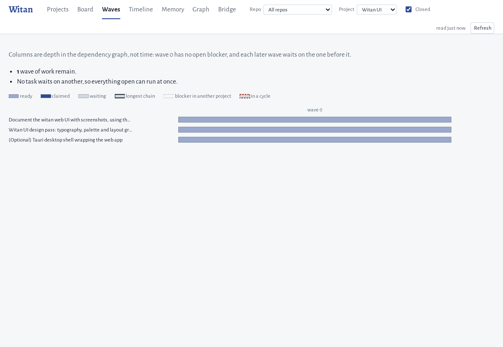
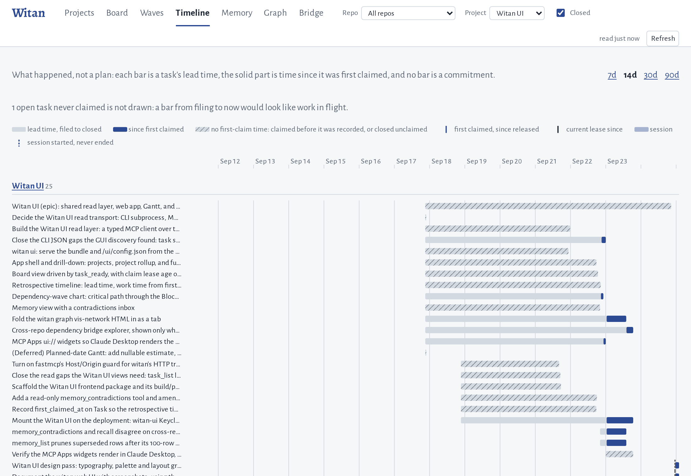
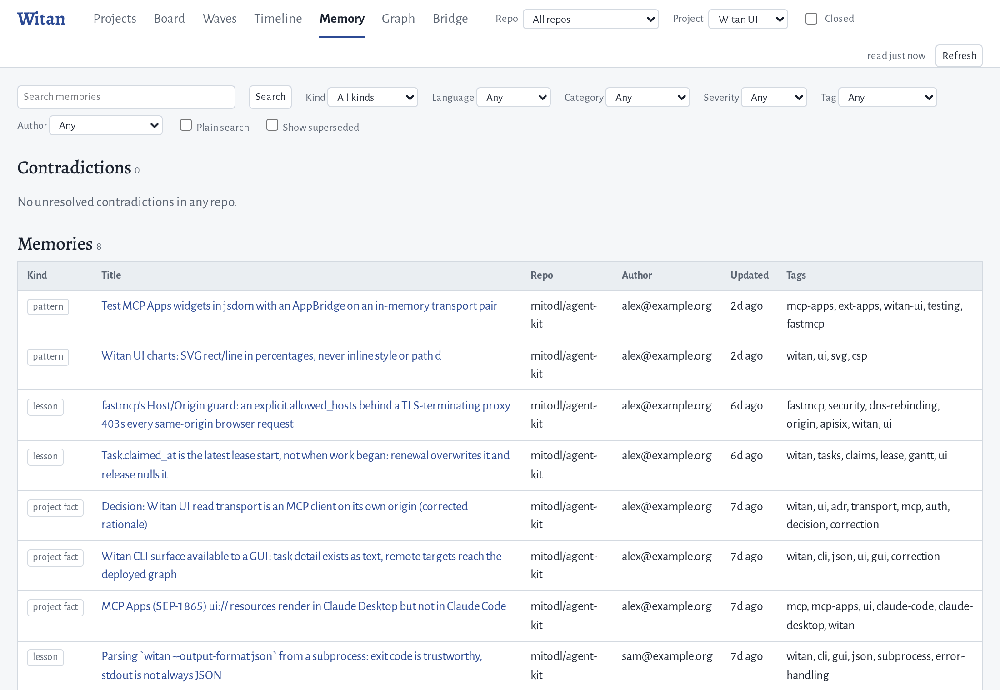
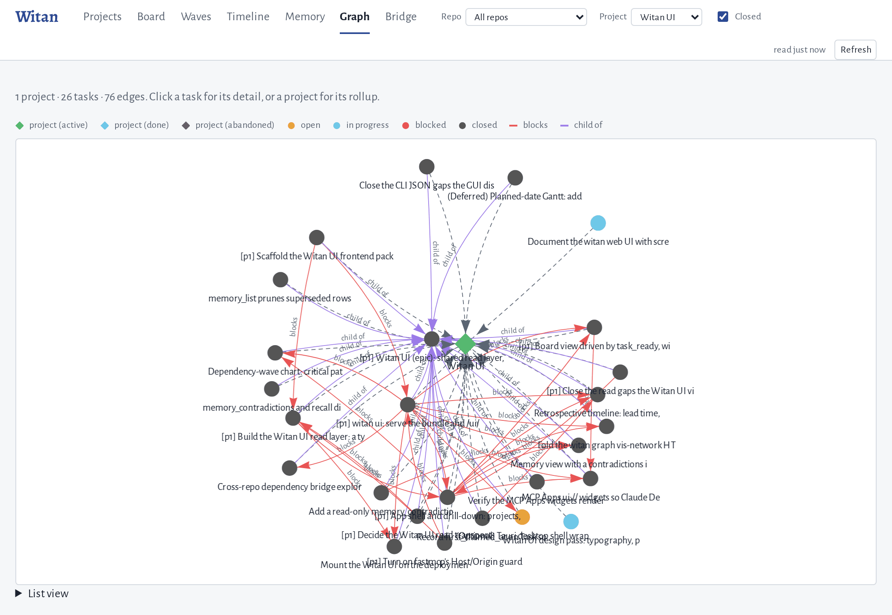

<!--
  MIRRORED FILE — DO NOT EDIT HERE.
  Edit mcp/servers/witan/docs/web-ui.md instead; `just docs-gen` copies it into the site.
-->

!!! info "This page lives with the code"

    The authoritative copy is
    [`mcp/servers/witan/docs/web-ui.md`](https://github.com/mitodl/agent-kit/blob/main/mcp/servers/witan/docs/web-ui.md).

# The witan web UI

The graph is written by agents, and most of it is only readable through MCP
tools or `witan` CLI output. The web UI is the view of it for a person: what is
ready, what is blocked, who holds a claim that has gone stale, where the last
two weeks went, and which memories contradict each other.

Every screenshot on this page is the Witan UI project itself
(`wp-cross-platform-witan-gui-11c03d`), the project that built the UI, read from
a copy of its tasks, sessions and memories.

## Opening it

Against your local store:

```bash
witan ui
```

This starts a witan server on 127.0.0.1 that serves both the page and `/mcp`,
and opens a browser on it. The port is one the OS says is free unless you pass
`--port` (or set `WITAN_UI_PORT`), and `--no-browser` prints the URL instead of
opening it. Nothing is exposed beyond localhost and no login is needed.

Against a deployed witan, open `https://<your witan host>/ui/` and log in with
the same SSO account you use for `witan login`. If your checkout resolves to a
remote target, `witan ui` opens that URL and exits rather than starting a local
server, because a local server forwarding to the deployment would hand your
token to anyone who can reach the port.

The page ships inside the `witan-council` wheel. A source install that never
ran the frontend build (`uv tool install` from a git checkout, e.g.) has no
bundle, and `witan ui` says so and names the build command.

## How the page behaves

Everything you change (the tab, the repo and project filters, the open task,
the search text) lives in the URL fragment. Copy the address bar to send
someone the exact view you are looking at, e.g. a board card with a lapsed
claim, open, for the person who holds it.

The views re-read every 30 seconds and when the window regains focus. The read
time sits at the right of the top bar. If a read fails, the last good data stays
on screen and is marked stale rather than being cleared, so a server restart
never shows up as an empty board.

The Closed checkbox in the top bar decides whether closed tasks are listed.
It is off by default, as in the CLI.

## Projects



The Projects tab lists workflow projects with their phase and status. Choosing
one opens its rollup: the description, the ready tasks, every task in the
project, and the session history with each session's hand-off summary.

Choosing a task opens it in the detail panel beside the view rather than over
it, so the list it came from stays readable.



The panel shows every field the task has, including the resolution, the
external link, the code symbols it concerns and the comment thread. Read the
comments before acting on a task: a comment is how an agent says a task's
premise is wrong without overwriting its description. Blockers, dependents and
children link to their own detail.

## Board



Ready, In progress, Blocked and Closed, in that order.

- Ready is `task_ready`'s own answer, so it matches what an agent is told to
  pick up next.
- In progress shows who holds each task and how old the claim is. A claim whose
  lease has lapsed is edged and badged "claim lapsed". The holder most likely
  abandoned it, and it is available to reclaim, which is why it also appears
  under Ready (as the two in the screenshot do).
- Blocked lists each card's open blockers, so you can see what it waits on.
- Closed shows the most recently closed first.

## Waves



Waves lays a project's open tasks out by depth in the dependency graph. Wave 0
has no open blocker, wave 1 waits only on wave 0, and so on. The longest chain
is outlined and a dependency cycle is drawn in red rather than breaking the
layout. The columns are depth, not dates: nothing here is a schedule.

## Timeline



The timeline is a record of what already happened, over the last 7, 14, 30 or
90 days. Each task's pale bar is its lead time, from filing to close, and the
solid part is the time since it was first claimed. The bottom lane is the agent
sessions that worked the project. With no project selected it covers every
project, grouped.

A hatched bar is a task with no first-claim time: it was claimed before witan
recorded one, or closed without ever being claimed. Most of the Witan UI
project's early tasks are hatched for the first reason. The legend above the
chart names every mark.

## Memory



The contradictions inbox comes first, each contradicting pair side by side so
the two claims can be read against each other. It is empty here because none of
this project's memories contradict each other.

Below it you can browse or search the memories. Search goes through `recall`,
so superseded memories are pruned and results are re-ranked the way an agent
sees them. Plain search switches to BM25 alone. Kind, language, category,
severity, tag and author narrow the list. Opening a memory shows its neighbours
grouped by edge kind, with asserted links drawn solid and inferred ones dashed.

## Graph



The same project and task graph `witan graph` draws, with the same colours.
Choose a task to open its detail, or a project for its rollup. A scope with more
than 400 nodes collapses each project into one node you can open. The List view
under the canvas has every node as a link, for keyboard use.

## Bridge

The Bridge tab appears only when the server has witan-code installed. It shows
which repos are coupled through shared environment variables, endpoints,
packages and services. Choose an edge for the contracts behind it, and a
contract for the file and line in each repo that provides or consumes it.

## Inside Claude Desktop

The UI's views also render inline in Claude Desktop and claude.ai as MCP Apps
widgets, on four tools: `task_ready` (the Ready column), `workflow_project_status`
(the project rollup), `recall` and `task_list`. A widget draws the one result
the tool returned and reads nothing further. Clients that do not render MCP
Apps, Claude Code included, show the tool's text result exactly as before.
