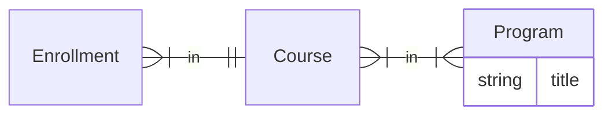

# Prefetching reference

Detail behind the data-loading rules in [SKILL.md](../SKILL.md).

## Pick the right prefetch tool

| Tool | Use it for | Cost |
| ---- | ---------- | ---- |
| `select_related(...)` | Foreign key relationships only | Joins onto the main query |
| `prefetch_related(...)` | One-to-many and many-to-many relationships | A separate query per relationship |
| `prefetch(...)` | Nested data the model has no direct relationship to | A separate query per prefetcher |

### `select_related()` vs `prefetch_related()`

It is possible to overuse `select_related()` to the point that you're actually
harming performance - too much data and too many joins will slow down the main
query.

When in doubt, reach for `prefetch_related()` - splitting the work into a separate
query is the safer default, with one systematic exception.

#### Unless the queryset already joins that table

Defaulting to `prefetch_related()` can be the wrong choice, and counterintuitively
hurt performance, when the base queryset filters or orders on a column of the
related table. Django has to join that table to evaluate the `WHERE` clause
whether or not you asked for its data, so `prefetch_related()` buys a second query
on top of a join you are already paying for:

```python
# Don't - the join happens for the filter, then a second query re-reads the same rows
Course.objects.filter(platform__name="edx").prefetch_related("platform")
```

```python
# Do - the join is already there; select_related() just adds its columns to the SELECT
Course.objects.filter(platform__name="edx").select_related("platform")
```

`filter(platform__name=...)` emits `INNER JOIN platform` but selects nothing from
it. `prefetch_related("platform")` then issues `SELECT ... FROM platform WHERE id
IN (...)` for rows the database already had in hand, while
`select_related("platform")` reuses the existing join: one query, one join, same
response. `order_by("platform__name")` forces the join the same way.

Note: foreign keys and one-to-ones only. A filter across a to-many relation also
joins, but there the join multiplies parent rows, so `prefetch_related()` - plus
`distinct()` on the outer query - is still the right tool.

For how far to take joins before splitting the query, see
[joins-and-query-plans.md](joins-and-query-plans.md).

## `prefetch()` for indirect relationships

`prefetch()` extends Django's prefetching capabilities via the
[django-prefetch](https://pypi.org/project/django-prefetch/) library. Reach for a
prefetcher when you need data the base model does not directly depend on.

An enrollment relates to a course, and a course to programs - but an enrollment
has no direct relationship to a program:



### The hooks

A prefetcher is a join Django can't express, executed in Python. The hooks are the
two sides of that join:

- `mapper()` runs over the objects already in your queryset and computes one key for each.
- `filter()` receives all the distinct keys at once and returns the related rows in a single query.
- `reverse_mapper()` runs over those related rows and says which keys each one belongs to.
- The library matches the two sets of keys and calls `decorator()` to attach the results.

| Hook | Returns | Purpose |
| ---- | ------- | ------- |
| `mapper(obj)` | one hashable key | The join key for an object in your queryset. Defaults to `obj.pk`. |
| `filter(keys)` | `QuerySet` | One query fetching every related row for all the collected keys |
| `reverse_mapper(related)` | list of keys | The keys a related row belongs to |
| `decorator(obj, related=None)` | `None` | Attaches the matches to the base object |
| `collect` | `bool` | Set `True` when several objects can share a key |

The asymmetry between the two mappers is deliberate: `mapper()` returns a single
key, while `reverse_mapper()` returns a **list** of them, because one related row
can belong to many of your objects.

`collect` defaults to `False`, which keeps only one object per key - if two
objects in your queryset produce the same key, only the last of them gets
decorated. Set it to `True` whenever `mapper()` isn't unique across the queryset.

```python
from django.contrib.postgres.aggregates import ArrayAgg
from prefetch import Prefetcher, PrefetchManagerMixin, PrefetchQuerySet


class ProgramTitlesPrefetcher(Prefetcher):
    collect = True

    def mapper(self, enrollment):
        return enrollment.course_id

    def filter(self, ids):
        if not ids:
            return Program.objects.none()
        # one query to fetch everything
        return Program.objects.filter(
            course__id__in=ids
        ).annotate(
            # postgres-specific aggregation
            course_ids=ArrayAgg("course__id")
        ).only("title")  # only the fields we will use

    def reverse_mapper(self, program):
        return program.course_ids

    def decorator(self, enrollment, programs=None):
        enrollment.program_titles = [program.title for program in programs] if programs else []


# NOTE: this is named mixin, but it's actually a subclass of models.Manager
class EnrollmentManager(PrefetchManagerMixin):
    prefetch_definitions = {
        "program_titles": ProgramTitlesPrefetcher
    }


class Enrollment(models.Model):

    objects = EnrollmentManager()


# Now you can do this and it will only perform 2 queries
Enrollment.objects.prefetch("program_titles")
```

### Footguns

- **Return an explicit empty queryset when there are no keys.** Otherwise you risk
  weird edge cases where `filter()` returns the entire table.
- **Give `decorator()`'s `related` argument a default.** It is called once for
  every object with no `related` argument at all, and then a second time only for
  the objects that matched - so the default you supply is the final answer for
  everything that matched nothing.
- **Don't use a key that can be falsy.** Matching skips falsy keys, so a key of
  `0` or `""` silently drops the relation. Tuples are safe here: any non-empty
  tuple is truthy.

### Joining on a composite key

The key is only ever used as a dictionary key, so it just has to be hashable. An
`int` or `str` covers most cases - but when the relationship is identified by more
than one column, return a **tuple**.

mitxonline's certificate and grade prefetchers join on `(run, user)` rather than a
single id ([courses/models.py](https://github.com/mitodl/mitxonline/blob/main/courses/models.py)):

```python
class CourseRunEnrollmentCertificatePrefetcher(Prefetcher):
    """Prefetcher for CourseRunEnrollment certificates"""

    @staticmethod
    def mapper(course_run_enrollment):
        """Map each enrollment to (run_id, user_id)"""
        return (course_run_enrollment.run_id, course_run_enrollment.user_id)

    @staticmethod
    def filter(course_run_and_user_ids):
        if not course_run_and_user_ids:
            return CourseRunCertificate.objects.none()

        id_filters = Q()

        # django 5.1 supports this via
        # django.db.models.fields.tuple_lookups.{Tuple,TupleIn}
        for course_run_id, user_id in course_run_and_user_ids:
            id_filters |= Q(course_run_id=course_run_id, user_id=user_id)

        return CourseRunCertificate.objects.filter(id_filters)

    @staticmethod
    def reverse_mapper(certificate):
        return [(certificate.course_run_id, certificate.user_id)]

    @staticmethod
    def decorator(course_run_enrollment, certificates=None):
        course_run_enrollment._certificate = certificates[0] if certificates else None
```

Three things to notice:

- `reverse_mapper()` still returns a list, just a one-element one - a certificate
  belongs to exactly one `(run, user)` pair. Contrast the program prefetcher
  above, which returns many keys.
- A composite key can't be a single `__in` lookup, so `filter()` ORs the pairs
  together with `Q`. On Django 5.1+ you can express this directly with
  `django.db.models.fields.tuple_lookups.{Tuple,TupleIn}`.
- `mapper()` is unique per enrollment here, so these prefetchers leave `collect`
  at its default.

### Custom QuerySets

`PrefetchManagerMixin` overrides `get_queryset()` and builds the queryset from
`get_queryset_class()`, which is hardcoded to return `PrefetchQuerySet`. It never
looks at `_queryset_class` - the attribute `models.Manager.from_queryset()` sets.

So `models.Manager.from_queryset(EnrollmentQuerySet)` + `PrefetchManagerMixin` is
not enough on its own. The mixin's `get_queryset()` wins the MRO, hands back a
plain `PrefetchQuerySet`, and your custom queryset is silently ignored - its
methods then raise `AttributeError` at the call site. You have to name the
queryset a second time:

```python
class EnrollmentQuerySet(TimestampedModelQuerySet, PrefetchQuerySet):
    ...


class EnrollmentManager(
    models.Manager.from_queryset(EnrollmentQuerySet), PrefetchManagerMixin
):
    """Base manager class for enrollments"""

    @classmethod
    def get_queryset_class(cls):
        return EnrollmentQuerySet
```

Two requirements, both load-bearing:

- The queryset must subclass `PrefetchQuerySet`. `PrefetchManagerMixin.get_queryset()`
  passes `prefetch_definitions=` to the constructor, and `.prefetch()` only exists there.
- `get_queryset_class` must be a `@classmethod`, matching the mixin's own declaration.

Naming `EnrollmentQuerySet` in both places looks redundant, but the two do
different jobs: `from_queryset()` copies the queryset's methods onto the manager,
while `get_queryset_class()` decides what the manager actually instantiates.

## Make one property work with and without a prefetch

A prefetch only happens on the queryset that asked for it. The same derived data
is usually also wanted from a celery task, a management command, the admin, or a
shell session - none of which went through your API's queryset. Writing it twice
means two implementations that can drift apart.

One `cached_property` can serve both paths. `cached_property` is a non-data
descriptor - it defines `__get__` but not `__set__` - so if the instance's
`__dict__` already holds that name, the property body never runs. Both Django's
`Prefetch(..., to_attr=...)` and django-prefetch's `Prefetcher.decorator()` fill
`__dict__` with a plain `setattr`. **Give the property the same name as the
prefetch** and you get the prefetched value when it's there and a query when it
isn't, with no extra wiring.

This is a supported pattern, not a trick: Django's prefetch machinery explicitly
checks `to_attr in instance.__dict__` rather than `hasattr()` when the attribute
is a `cached_property`, specifically so it doesn't trigger the fallback while
deciding whether the value is already loaded.

### With `prefetch_related()`

If you only need to read a relation, you need none of this - `.all()` already uses
a warm prefetch cache and queries when there isn't one:

```python
class Course(models.Model):
    @cached_property
    def topic_names(self) -> list[str]:
        return [topic.name for topic in self.topics.all()]
```

**Filtering after `.all()` bypasses the prefetch cache.**
`self.topics.filter(published=True)` ignores a warm cache and issues a fresh query
for every object - the N+1 you thought you had prefetched away. Either filter in
Python over `.all()`, or move the filter into the prefetch itself.

Moving the filter into the prefetch is where `to_attr` earns its keep. Prefetch
under the same name the property uses:

```python
Course.objects.prefetch_related(
    Prefetch("topics", queryset=Topic.objects.published(), to_attr="published_topics")
)
```

```python
from django.utils.functional import cached_property


class Course(models.Model):
    @cached_property
    def published_topics(self) -> list["Topic"]:
        # Fallback: runs only when the prefetch above didn't fill __dict__.
        return list(self.topics.published())
```

- Prefetched - `to_attr`'s `setattr` filled `__dict__`, so the property never runs.
- Not prefetched - the property runs, queries for this one course, and caches the
  result on the instance.

### With `prefetch()`

Same mechanism, for the indirect case - `decorator()` does the `setattr` instead
of `to_attr`:

```python
class Enrollment(models.Model):
    objects = EnrollmentManager()

    @cached_property
    def program_titles(self) -> list[str]:
        # Fallback: runs only when prefetch("program_titles") didn't fill __dict__.
        return list(
            Program.objects.for_course_ids([self.course_id]).values_list("title", flat=True)
        )
```

Either way callers just read `course.published_topics` or
`enrollment.program_titles` and never need to know which path they got.

### Antipattern: a sentinel attribute plus `hasattr()`

That dispatch is often written out by hand instead - the prefetch targets a
private or prefixed name, and the property branches on whether it landed:

```python
# b2b/api.py
Prefetch(
    "contract_programs",
    queryset=ContractProgramItem.objects.order_by("sort_order"),
    to_attr="_contract_program_ids",
)

# b2b/models.py
@cached_property
def contract_program_ids(self):
    return (
        self._contract_program_ids
        if hasattr(self, "_contract_program_ids")
        else self.contract_programs.order_by("sort_order").all()
    )
```

Dropping the underscore - `to_attr="contract_program_ids"` - makes the property
body unreachable when the prefetch ran, leaving no branch to maintain.
`Prefetcher.decorator()` has the same choice: `setattr(obj, "certificate", ...)`
over `obj._certificate = ...`.

The sentinel costs more than it buys:

- The branch is re-implemented per property and leaks to callers.
- The private attribute is written from outside its class, so prefetchers and
  tests need `# noqa: SLF001`.
- Two names for one value drift over time.

**When the property isn't the prefetched value:** shadowing needs the property to
be what the prefetch produces. `is_upgradable`, deriving a boolean from prefetched
products, can't be a `to_attr` target - and `to_attr` can't take the relation's
own name either (`to_attr=products` conflicts with a field on the `CourseRun`
model). Give the relation its own same-name `cached_property` and let the derived
property read that.

### Keep the two paths querying the same thing

The pattern is only safe if both paths mean the same thing by the data. Put the
predicate in one queryset method and call it from both, rather than writing the
filter twice:

```python
class TopicQuerySet(models.QuerySet):
    def published(self):
        return self.filter(published=True)


class Topic(models.Model):
    objects = TopicQuerySet.as_manager()
```

Now `Prefetch("topics", queryset=Topic.objects.published(), ...)` and the
`cached_property`'s `self.topics.published()` share one definition of "published
topics", so a change to the predicate can't reach only one of them. The same
discipline applies to a `Prefetcher.filter()` - have it call the same queryset
method with all the collected ids at once.

### The fallback is the N+1 you were avoiding

Per-object querying is exactly what prefetching exists to prevent. That's a fine
trade in a celery task walking a handful of records, and unacceptable in a list API.

The real danger is that the fallback is **silent** - a missing prefetch doesn't
raise, it just quietly issues one query per row. That is why serializers declare
`required_prefetches`: it turns the silent N+1 back into a loud failure on the
path where it matters.
